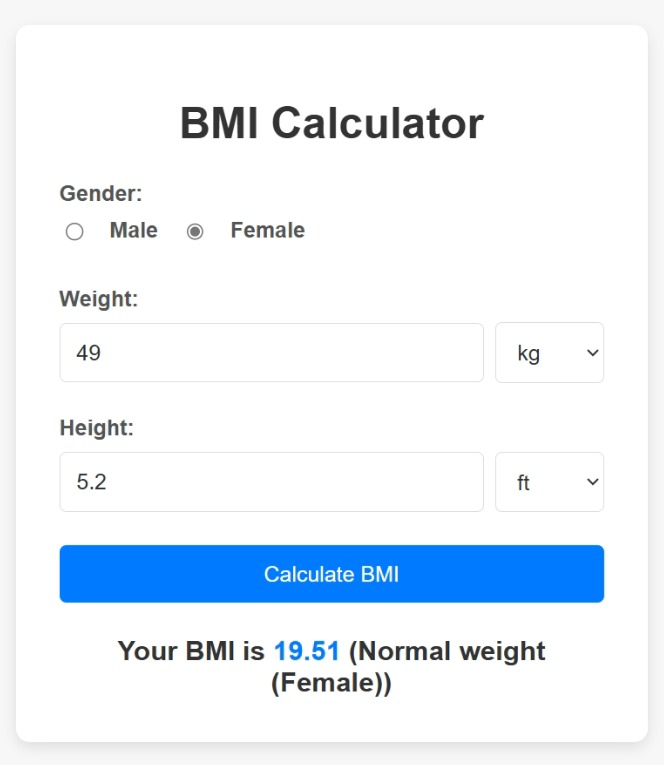

Here’s the updated **`README.md`** file with the image (`img.jpeg`) included using a relative path:

---

```markdown
# BMI Calculator

A simple and user-friendly **BMI (Body Mass Index)** calculator built using HTML, CSS, and JavaScript. This tool allows users to calculate their BMI based on weight and height inputs, with options to switch between metric and imperial units. It also includes a gender selection feature for additional insights.

 <!-- Image in the same folder -->

---

## Features

- **BMI Calculation**: Calculate your BMI using weight and height inputs.
- **Unit Conversion**: Supports both metric (kg, m) and imperial (lbs, ft) units.
- **Gender Selection**: Choose between Male and Female for personalized insights.
- **Responsive Design**: Works seamlessly on all devices (desktop, tablet, mobile).
- **Float Values**: Accepts decimal values for weight and height (e.g., 65.5 kg, 1.75 m).
- **Red Circular Buttons**: Stylish radio buttons for gender selection.

---

## How to Use

1. **Select Gender**:
   - Choose your gender using the red circular buttons (Male or Female).

2. **Enter Weight**:
   - Input your weight in the provided field.
   - Select the unit (kg or lbs) from the dropdown.

3. **Enter Height**:
   - Input your height in the provided field.
   - Select the unit (m or ft) from the dropdown.

4. **Calculate BMI**:
   - Click the "Calculate BMI" button to see your BMI result.

5. **View Result**:
   - Your BMI and corresponding category (e.g., Underweight, Normal weight, Overweight, Obesity) will be displayed.

---

## Code Structure

- **`index.html`**: Contains the structure of the BMI calculator.
- **`styles.css`**: Includes all the styling for the calculator.
- **`script.js`**: Handles the BMI calculation logic and unit conversions.

---

## Installation

1. Clone the repository:
   ```bash
   git clone https://github.com/your-username/bmi-calculator.git
   ```

2. Navigate to the project directory:
   ```bash
   cd bmi-calculator
   ```

3. Open `index.html` in your browser:
   ```bash
   open index.html
   ```

---

## Technologies Used

- **HTML**: For the structure of the calculator.
- **CSS**: For styling and responsive design.
- **JavaScript**: For BMI calculation and dynamic functionality.

---

## Screenshots

 <!-- Image in the same folder -->

---

## Contributing

Contributions are welcome! If you'd like to improve this project, please follow these steps:

1. Fork the repository.
2. Create a new branch (`git checkout -b feature/YourFeatureName`).
3. Commit your changes (`git commit -m 'Add some feature'`).
4. Push to the branch (`git push origin feature/YourFeatureName`).
5. Open a pull request.

---

## License

This project is licensed under the MIT License. See the [LICENSE](LICENSE) file for details.

---
## Contact

For any questions or feedback, feel free to reach out:

- **Email**: your-email@example.com
- **GitHub**: [your-username](https://github.com/your-username)
```

---

### Key Updates:
1. Added the image `img.jpeg` using the relative path `./img.jpeg`.
2. Included the image in the **Screenshots** section and at the top of the `README.md`.

---

### How to Use:
1. Save this content in your `README.md` file.
2. Ensure `img.jpeg` is in the same folder as `README.md`.
3. Commit and push both files to your GitHub repository.

---

Let me know if you need further assistance! 😊